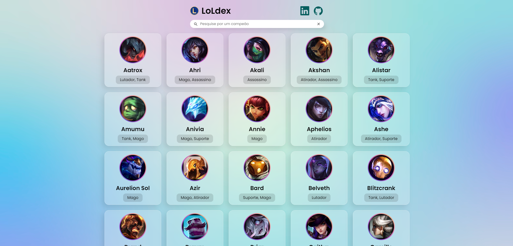

<h1 align="center">
  LoLdex
</h1>

<h4 align="center"><a href="https://juniorod99.github.io/loldex/">Clique para visitar o projeto</a></h4>

## 📚 Projeto

Quase uma pokedex, mas para campeões de League of Legends utilizando a API da Riot Games que através dela recebemos todos os dados dos campeões.

## 💼 Tecnologias utilizadas

Para o desenvolvimento deste projeto utilizei as seguintes tecnologias:

- HTML;
- CSS;
- JavaScript;
- Riot API;
- Splide;
- Git e Github;

## 🤯 Aprendizado

Durante o desenvolvimento desse projeto aprendi a utilizar diversas funcionalidades do JavaScript, como:

- Fazer requisições API;
- Manipular arrays, strings e objetos;
- Manipular o DOM;
- Criar o HTML no JavaScript e passar dados dinamicamente;
- Pegar valores da URL da página;

## 🔧 Ajustes e melhorias

O projeto ainda está em desenvolvimento e as próximas atualizações serão voltadas nas seguintes tarefas:

- [ ] Pegar playlist do youtube e transformar em JSON
- [ ] Importar JSON no player de música
- [ ] Reproduzir músicas a partir do JSON
